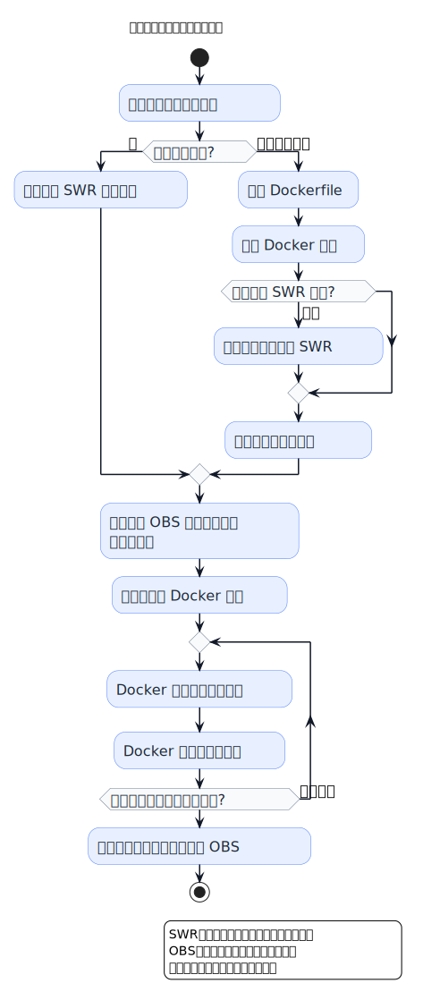
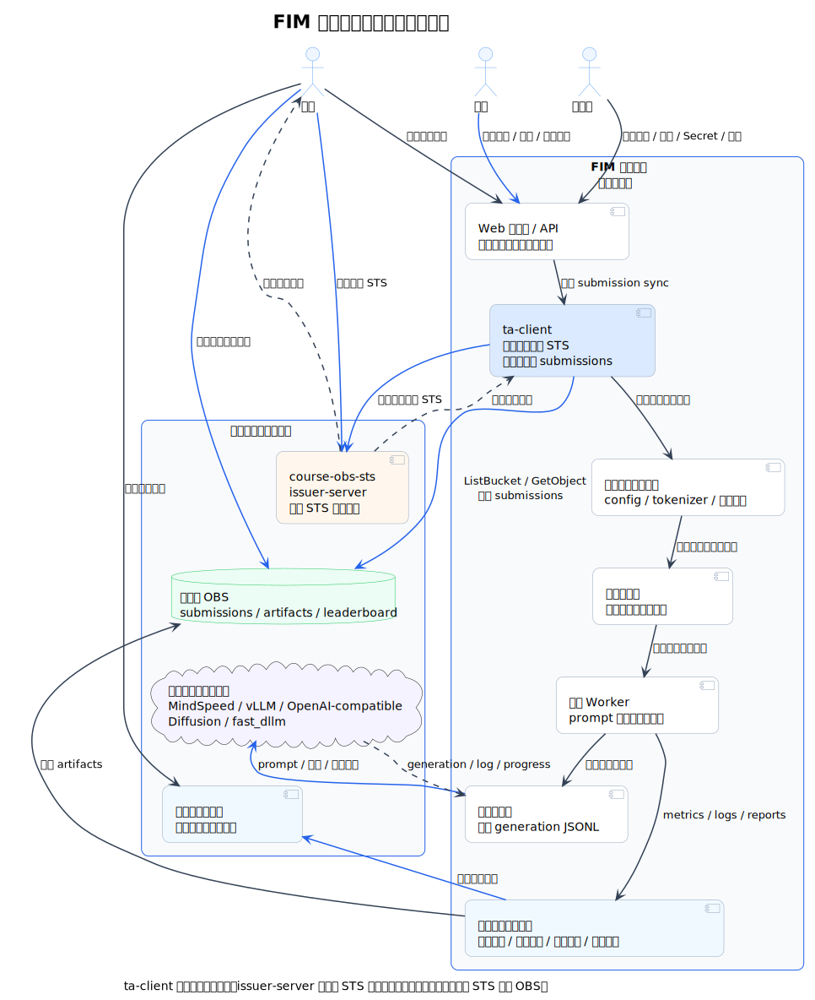
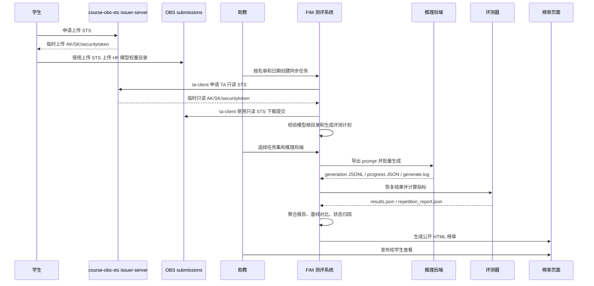
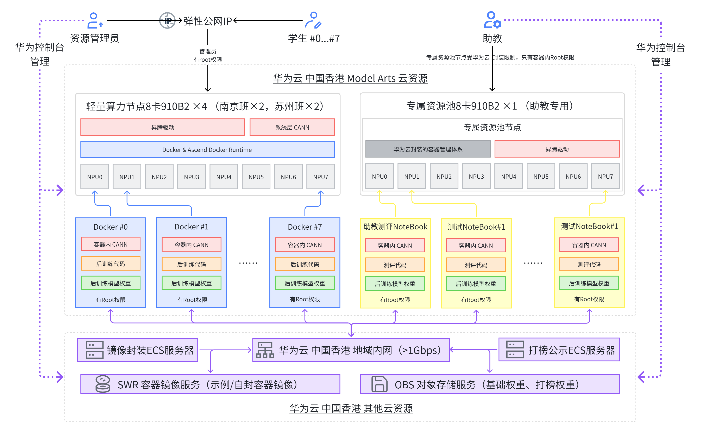
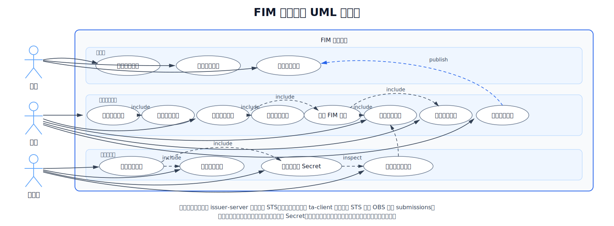

# 大语言模型代码补全能力测评系统需求

## 1. 背景与目标

代码补全是 LLM 在软件工程中的高频应用形态。相较于一次性生成完整程序，FIM（Fill-in-the-Middle）更贴近 IDE 中的插入、修补和局部续写：模型需要同时理解前缀和后缀，在有限上下文与低延迟约束下补出中间片段。课程项目要求学生围绕小参数代码模型完成后训练、评估和打榜，因此需要一个能稳定衡量 FIM 能力的测评系统。

FIM 测评不能只看单一正确率。一个可用于真实代码补全场景的模型，还需要减少复制前缀或后缀的复读行为，避免生成迟迟不停止造成 TLE，控制平均生成 token 数，并在多个测试集与任务口径上保持可复现的指标。若仍依赖助教手工下载权重、手工检查目录、分别运行不同后端并拼接报告，评测结果容易出现环境漂移、遗漏提交、异常状态不可追踪和榜单口径不一致等问题。

当前仓库已经具备 MindSpeed-LLM 适配、多测试集评测、结果可视化、批量聚合和公开榜单生成能力。后续系统化目标不是重写评测器，而是把“提交拉取、模型校验、后端选择、评测执行、结果归档、榜单发布”组织为可审计、可扩展、可部署的测评服务，让助教能按统一规则处理整班提交，让学生能看到公开、稳定且不泄露内部数据的结果。

### 1.1 学生课程项目流程

学生侧课程项目流程决定了测评系统的提交入口和校验边界。学生先登录轻量算力节点，使用课程现成镜像或自建 Docker 镜像，在容器内下载基础权重、完成模型后训练和本地评估，经过闭环调优后把打榜模型权重上传到 OBS。该流程要求系统能够理解容器化训练产物、OBS 提交路径、模型根目录结构和最终打榜权重之间的关系。



### 1.2 系统边界与上游依赖

上游学生提交和权重拉取参考南大 Git 仓库：https://git.nju.edu.cn/njuse-llm4se/course-obs-sts 。在本系统边界中，`ta-client` 属于 FIM 测评系统的一部分，负责以助教身份申请只读 STS 并从 OBS 拉取 submissions；`issuer-server` 是外部 STS 签发服务。学生上传模型权重到 OBS 前，同样需要先向 `issuer-server` 申请上传权限，再使用临时凭证写入 submissions 前缀。

当前主推理后端参考南大 Git 仓库：https://git.nju.edu.cn/njuse-llm4se/mindspeed-llm 。现有代码以 MindSpeed-LLM + Ascend + MCore 权重为推荐链路，但后续可能支持更多推理后端，包括 vLLM、OpenAI-compatible completions、diffusion / fast_dllm 等，系统在需求设计时应当满足相关需求。

### 1.3 推理后端契约

推理后端契约的设计目标是封装不同推理后端的内部差异。系统不要求所有后端使用同一种模型加载方式、并行策略或服务形态；只要求后端能接收统一的 prompt、模型引用和采样参数，并返回格式一致的生成结果。这样后续恢复结果、指标计算、复读/TLE 分析、可视化和榜单发布都可以复用同一条链路。

评分层统一称为 `evaluator` 或“指标计算器”。在当前代码中，它不是一个单独服务，而是由各任务的 `results_evaluator`、公共指标工具和复读/TLE 分析脚本共同完成。只要推理后端输出的 `generation JSONL` 能被桥接层恢复为 evaluator 可读结果，指标计算器就能正常计算 EM、ES、ES_repoeval、复读率和 TLE，并把结果交给报告和榜单生成链路。

推理服务后端的输入和输出约定为：

```text
输入：
  prompt_file: 标准 prompt JSONL
  model_ref: 本地权重目录、MCore 目录或远程模型标识
  backend: mindspeed | vllm | openai_completions | diffusion | fast_dllm
  sampling: temperature/top_p/max_tokens/stop 等采样参数
  runtime: batch size、设备、并行参数、超时和日志路径

输出：
  generations_file: 每条样本对应 prompt、生成文本、状态和可选 TLE 信息
  progress_file: 样本进度、批次进度、ETA
  logs: generate.log / eval.log
  metadata: 后端版本、模型来源、运行参数、失败原因
```

系统上下文范围说明系统边界、外部服务和凭证流向。



学生提交到评测结果发布的核心流程包括：



系统涉及的利益相关者只有三类：

| 角色 | 主要目标 |
| --- | --- |
| 学生 | 按课程要求提交模型权重，查看自己的授权结果和公开排名与关键指标 |
| 助教 | 批量拉取提交、运行评测、查看内部报告、确认并发布公开榜单 |
| 管理员 | 管理系统部署、镜像、后端适配、Secret 引用、权限配置和故障处理 |

系统的物理部署参考仓库根目录 `deployment_arch.png`。华为云是系统部署和运行环境，不属于本系统需要维护的对象；管理员只负责系统在该环境中的部署配置与运行维护。当前系统和测评后端部署在助教测评 Notebook。



## 2. 需求分析

### 2.1 功能需求

| 编号 | 需求 | 说明 |
| --- | --- | --- |
| FR-01 | 课程提交拉取 | 学生上传前由外部 `issuer-server` 签发上传 STS；系统内 `ta-client` 以助教身份申请只读 STS，按课程、作业、学生名单和日期拉取模型权重。 |
| FR-02 | 模型根目录校验 | 下载后检查每个学生日期目录根部是否直接包含 `config.json`、`tokenizer.json` 和权重文件，识别上传父目录等错误。 |
| FR-03 | 多测试集评测 | 支持多个 FIM/代码补全测试集和任务口径，并通过配置选择数据集、评分模式和样本范围。 |
| FR-04 | 多推理后端 | 通过统一后端契约选择 MindSpeed、vLLM、OpenAI-compatible completions、diffusion / fast_dllm 等后端。 |
| FR-05 | 结果恢复与指标计算 | 统一把后端 generation JSONL 恢复为 evaluator/指标计算器输入，计算 EM、ES、ES_repoeval、复读率、TLE 等指标。 |
| FR-06 | 内部聚合报告 | 生成 `aggregate_report.json/csv/md`、批量可视化网页和基线对比信息。 |
| FR-07 | 公开榜单 | 生成不含本地绝对路径、模型路径、tokenizer 路径和逐样本内容的公开 HTML 榜单。 |
| FR-08 | 状态管理 | 识别 ok、absent、tokenizer_error、vocab_error、missing_raw_result、recompute_failed、missing_metric 等状态。 |
| FR-09 | 审计与复现 | 保存评测配置、后端、任务、样本数、日志、指标和评分源码，支持重算报告。 |
| FR-10 | 服务化接口规划 | 为后续在线部署提供提交同步、评测创建、进度查询、榜单查询和 artifact 下载接口。 |
| FR-11 | 实时日志可视化 | TA 能在浏览器端实时查看评测阶段、日志、进度、失败原因和 artifact ready 事件；学生只能查看授权摘要。 |

### 2.2 非功能需求

| 编号 | 需求 | 说明 |
| --- | --- | --- |
| NFR-01 | 安全性 | 长期 AK/SK 只保存在签发服务端；系统只使用 TA 临时只读凭证拉取提交。 |
| NFR-02 | 隔离性 | 学生权重、运行日志、逐样本结果和公开榜单分层存储，公开页面不泄露敏感路径与样本内容。 |
| NFR-03 | 可靠性 | STS 过期、OBS 中断、Worker 崩溃、后端超时和 artifact 写入失败时，应能重试、恢复或明确标记失败；重复请求不得造成重复下载、重复评测或重复发布。 |
| NFR-04 | 可用性 | 真实后端不可用时，系统仍可使用 mock backend、sample results 或已有 raw 结果演示报告和榜单链路；已发布榜单应能继续访问。 |
| NFR-05 | 可扩展性 | 新增推理后端时不改评测器主体；API、Worker 和后端适配应支持按任务队列和部署副本水平扩展。 |
| NFR-06 | 高效性 | 批量评测应支持增量下载、分批执行、已有 MCore 权重复用、可配置 batch size 和并发上限，避免浪费推理资源。 |
| NFR-07 | 可观测性 | 生成、恢复、指标、榜单发布等阶段需要进度、日志、trace id、失败原因和浏览器实时回传。 |
| NFR-08 | 可维护性 | 推荐链路、历史兼容链路、配置、Secret 引用、部署 Profile 和后端镜像边界应清晰，避免依赖混装和硬编码。 |
| NFR-09 | 可复现性 | 每次评测和榜单发布应保存数据集、评分模块、后端版本、运行参数、配置摘要和重算入口。 |
| NFR-10 | 兼容性 | 不同 CANN、torch_npu、MindSpeed-LLM、vLLM、OpenAI SDK 版本应记录在任务元数据中，支持回溯和隔离。 |
| NFR-11 | 公平性 | 同一榜单批次应固定数据集、评分模块、后端参数和提交截止策略；学生只能查看自己的授权结果和已发布榜单。 |
| NFR-12 | 可部署性 | API、Worker、前端、榜单服务和推理后端应能以容器化方式部署，并通过集中配置切换本地、助教 Notebook 和后续集群化形态。 |

### 2.3 用例图

用例图用于概括学生、助教、管理员三类角色与系统交互。



关键用例说明见表格。

| 用例组 | 触发者 | 前置条件 | 主流程 | 结果 |
| --- | --- | --- | --- | --- |
| 提交模型权重 | 学生 | 学生已完成容器内后训练和本地评估，且已从外部 `issuer-server` 取得上传 STS | 按课程 OBS `submissions` 约定上传 HuggingFace 模型根目录 | OBS 中形成可被助教同步任务发现的提交 |
| 查看本人结果 | 学生 | 助教已发布或授权学生查看评测摘要 | 通过 Web 或榜单入口查看本人状态、关键指标和失败提示 | 学生只能看到本人授权结果，不接触内部日志和逐样本内容 |
| 查看公开榜单 | 学生 | 助教已发布公开榜单 | 打开公开榜单页面，查看排名、汇总指标、状态说明和审计规则 | 学生看到公开结果，不接触内部路径和隐藏样本 |
| 拉取与校验学生提交 | 助教 | 课程、作业、名单、日期策略和 `TA_TOKEN` 已配置 | 系统内 `ta-client` 申请助教只读 STS，列举/下载 OBS `submissions`，并执行模型根目录校验 | 本地形成可评测 `submissions` 镜像目录，错误提交被提前标记 |
| 创建并运行评测任务 | 助教 | 学生权重目录已准备，评测环境和后端资源可用 | 选择任务集、推理后端、样本限制和评分策略；系统导出 prompt、调用后端、回收 generation JSONL | 写入任务状态、实时日志、progress JSON 和原始 generation |
| 生成内部报告 | 助教 | 评测 raw 结果和指标计算器可用 | 恢复结果、计算 EM/ES/Pass@1/复读/TLE/生成 token 等指标，做基线对比和失败归因 | 生成内部报告、可视化 HTML 和排障信息 |
| 发布公开榜单 | 助教 | 内部结果已经确认且敏感字段过滤通过 | 选择榜单范围并发布公开 HTML/静态 artifact | 学生可访问公开榜单，发布操作可审计可回滚 |
| 管理系统部署 | 管理员 | 目标运行环境、镜像、配置 Profile 和 Secret 引用已准备 | 配置 API、Worker、前端、队列、后端镜像、健康检查和资源池 | 系统在华为云环境中可部署、可观测、可恢复 |
| 维护后端适配 | 管理员 | 新后端可接收 prompt 并输出 completion | 实现参数转换、stop 规则、日志和 generation JSONL 适配 | 新后端接入统一评测链路，不改 evaluator 主体 |
| 配置权限与 Secret | 管理员 | 课程角色、Secret 引用和访问策略已定义 | 配置学生/助教/管理员权限、SecretRef、公开榜单策略和审计规则 | 权限最小化，学生无法越权访问他人结果或内部日志 |
| 处理故障与恢复 | 管理员 | 告警、日志、任务状态和 artifact 元数据可用 | 查看实时日志和 trace id，处理 Worker 崩溃、OBS/STS 异常、后端超时和榜单回滚 | 故障可定位，任务可重试或明确失败，已发布榜单可恢复 |

## 3. 补充说明

### 3.1 现有实现与需求差距

现有实现基线以已发布代码版本为口径，说明当前项目已经具备的能力以及与目标需求之间的差距。

| 领域 | 已实现能力 | 与目标需求的主要差距 |
| --- | --- | --- |
| MindSpeed 评测链路 | 已有 `scripts/run_*_mindspeed.sh`、`mindspeed_fim_bridge.py`、HF 到 MCore 转换、MindSpeed 批量生成、结果恢复和单任务指标计算。 | 仍是脚本驱动，不是 API + 队列 + Worker 的在线任务系统；任务状态没有持久化服务端模型。 |
| 评测任务覆盖 | 已支持多个 FIM/代码补全测试集的任务入口。 | 任务目录、评分模式和样本策略尚未纳入统一配置中心和服务端白名单。 |
| 推理后端 | MindSpeed 是推荐链路；vLLM、OpenAI-compatible、diffusion / fast_dllm 等旧代码保留为兼容参考。 | 多后端还没有统一的后端注册、契约校验、资源池调度和容器隔离实现。 |
| 指标与重算 | 当前通过各任务 evaluator、公共指标工具和复读/TLE 分析脚本计算 EM、ES、ES_repoeval、复读率、TLE 等指标，并支持从已有 raw 结果重算。 | 尚未把 evaluator 版本、评分源码、配置快照和重算记录固化为每个 evaluation artifact 的强制元数据。 |
| 批量学生模型 | 已有批量脚本生成器，可扫描 submissions 树，按学生和日期生成脚本、运行评测、写入 progress/log、生成聚合报告。 | 尚未直接集成 `course-obs-sts` 的 `ta-client` 拉取流程，也没有把名单、日期策略和 OBS 同步做成可审计任务。 |
| 报告与榜单 | 已能生成单任务 `visualization.html`、批量 `aggregate_report.*`、内部聚合网页和公开榜单 HTML；公开榜单支持列配置、i18n、状态识别和排名规则审计。 | 还没有 B-S Web 控制台、学生鉴权查分、实时日志长连接、artifact 下载 API 和发布回滚服务。 |
| 校验与测试 | 已有依赖检查、模型目录校验测试、复读分析测试和 legacy 截断规则测试。 | 缺少服务化后的端到端测试、权限测试、队列恢复测试、集群资源配额测试和故障演练。 |

### 3.2 测试集上的评估指标

本系统具体测量学生提交的大语言模型在测试集上的以下指标，并把它们区分为排名指标和审计指标：

| 指标                                                         | 含义                                                         | 默认公开 Score 中的作用           |
| ------------------------------------------------------------ | ------------------------------------------------------------ | --------------------------------- |
| `EM` / `exact_match_rate`                                    | 生成补全与参考答案完全一致的比例，取值 0-100，越高越好。     | 参与计算，权重 0.20。             |
| `ES` / `average_edit_similarity`                             | 生成补全与参考答案的编辑相似度，取值 0-100，越高越好。       | 参与计算，权重 0.70。             |
| `ES_repoeval`                                                | RepoEval 风格编辑相似度，主要用于内部分析和跨任务对比。      | 默认公开 Score 不直接使用。       |
| `tle_ratio` / `TLE通过率`                                    | `tle_ratio` 表示命中长度上限或未正常停止的样本比例，越低越好；公开页折算为 `TLE通过率 = 100 * (1 - tle_ratio)`。 | `TLE通过率` 参与计算，权重 0.05。 |
| `prefix_repetition_ratio`、`suffix_repetition_ratio` / `非复读率` | 衡量生成内容直接复制前缀或后缀的比例，越低越好；公开页折算为 `非复读率 = 100 * (1 - prefix_repetition_ratio - suffix_repetition_ratio)`。 | `非复读率` 参与计算，权重 0.05。  |
| `total`、生成 token 数、任务状态                             | 记录样本量、生成长度、`ok/absent/tokenizer_error/vocab_error` 等状态，用于审计、排障和解释结果。 | 不直接加分。                      |

默认公开榜单的最终展示分 `Score` 不是原始 benchmark 指标，而是用于排名的综合分。在四项排名指标都可用时：

```text
Score = 0.20 * EM + 0.70 * ES + 0.05 * TLE通过率 + 0.05 * 非复读率
```

只有 `status=ok` 且 `EM`、`ES` 可计算的提交才参与排名；当 `TLE通过率` 或 `非复读率` 缺失时，当前实现会把缺失项从分母中移除并按可用权重归一，避免把缺失值直接当作 0 分。排名时先按 `Score` 降序，再按 `ES` 降序，仍相同则按 `student_id` 升序。
